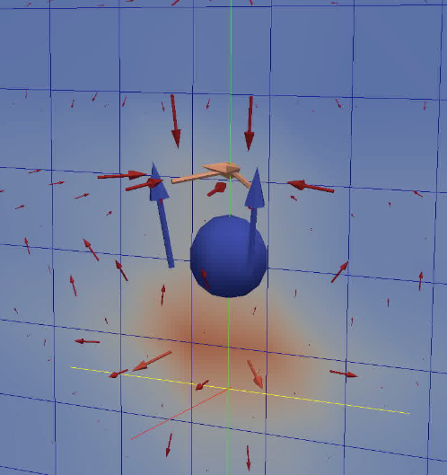
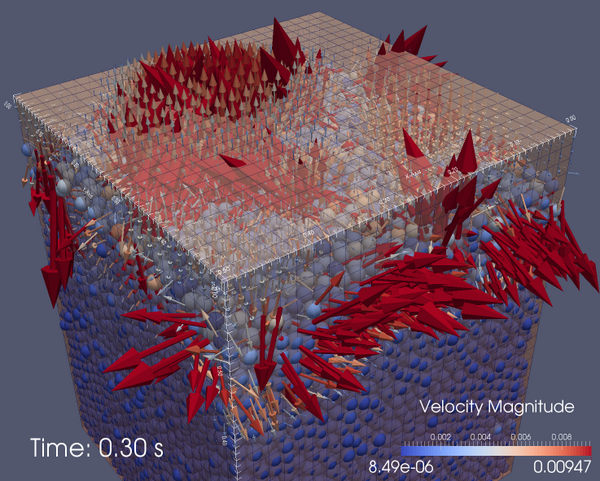
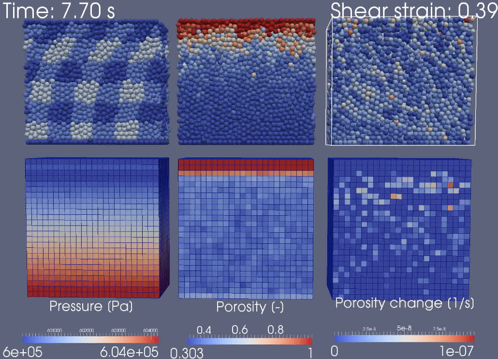

.. image:: https://badges.gitter.im/Join%20Chat.svg
   :alt: Join the chat at https://gitter.im/anders-dc/sphere
   :target: https://gitter.im/anders-dc/sphere?utm_source=badge&utm_medium=badge&utm_campaign=pr-badge&utm_content=badge

=============
sphere readme
=============
``sphere`` is a 3D discrete element method algorithm utilizing CUDA. ``sphere``
allows for optional simulation of two-way coupled fluid flow using the
Navier-Stokes or Darcy formulations.

A powerful Nvidia GPU with proper support for double precision floating is
highly recommended. ``sphere`` has been tested with Nvidia Tesla GPUs, and has 
successfully been employed on the clusters `Grendel 
<https://www.cscaa.dk/grendel/hardware/>`_ (Aarhus University), `ICME 
<https://icme.stanford.edu/computer-resources/gpu-cluster>`_ (Stanford 
University), `Comet <https://www.sdsc.edu/services/hpc/hpc_systems.html#comet>`_ 
(San Diego Supercomputing Center),  `Bridges 
<https://psc.edu/index.php/resources/computing/bridges>`_ (Portland 
Supercomputing Center), and `Stampede <https://www.tacc.utexas.edu/stampede/>`_ 
(Texas Advanced Supercomputing Center).

License
-------
``sphere`` is licensed under the GNU General Public License, v.3.
See `LICENSE.txt <LICENSE.txt>`_ for more information.

Important release notes
-----------------------
2017-09-07: CUDA 8 comes with new requirements to the host CC/C++ compiler.  If 
GCC5 is not available on the system, run the following command before invoking 
`make`::

    export CC=$(which clang-3.8) && export CXX=$(which clang++-3.8) && cmake .

2016-08-16: Scale-invariant grain-contact model implemented based on Ergenzinger 
et al 2010 and Obermayr et al 2013.  To use specify a positive Young's modulus 
with ``setYoungsModulus(<value>)`` in the Python module.  This overrides any 
contact stiffnesses specified in ``k_n`` and ``k_t``.  This command should be 
used before the timestep length is determined in ``initTemporal(...)``.

2016-08-14: Dirichlet and von Neumann horizontal boundary conditions implemented 
in addition to horizontal periodicity for the Darcian fluid solver.

2015-09-06: A new flux boundary condition has been added to the Darcy fluid
solver.

2014-11-05: A Darcy solver has been added as an alternative to the Navier-Stokes
solver of the fluid phase. It can be selected with e.g. ``initFluid(cfd_solver =
1)`` in the Python module.

2014-07-28: Fluid flow is no longer simulated in a separate program. Use
``sphere`` with the command line argument ``-f`` or ``--fluid`` instead.

2014-07-05: Fluid phase now discretized on a staggered grid which increases
accuracy and stability.

2014-03-25: Fluid phase in ``master`` branch simulated by the full Navier-Stokes
equations.

2014-03-09: The ``writebin`` member function of the ``sim`` class is now
implicitly called when calling the ``run`` member function.

2014-03-09: The main sphere class (formerly ``spherebin``) has been renamed to
``sim``.

2014-01-20: Version fingerprints have been added to the input/output binary
files, and causes old files to be incompatible with either ``sphere`` or
``sphere.py``.

2014-01-25: The description of the installation procedure is moved to the
general documentation.

2013-03-13: Sphere has been updated to work with CUDA 5.0 or newer *only*.

Documentation
-------------
See the separate documentation for general reference and installation
instructions. The documentation is by default available in
the `html <doc/html/index.html>`_ and `pdf <doc/pdf/sphere.pdf>`_ formats.

Examples
--------
All examples are visualized using `ParaView <https://www.paraview.org>`_.

   A particle moving downwards through a fluid column causing fluid flow.

   Consolidation test of a particle/fluid assemblage.

   Shear of a dense particle assemblage. Top left: particles colored by initial
   positions, top center: particles colored by horizontal velocity, top right:
   particles colored by pressure. Bottom left: fluid pressures, bottom center:
   porosities, bottom right: porosity changes.

Publications
------------
``sphere`` has been used to produce results in the following scientific
publications and presentations:

- Damsgaard, A., J. Suckale, J. A. Piotrowski, M. Houssais, M. R. Siegfried, H.
  A. Fricker (2017), Sediment behavior controls equilibrium width of subglacial
  channels, Journal of Glaciology, 
  `doi:10.1017/jog.2017.71 
  <https://doi.org/10.1017/jog.2017.71>`_.
- Damsgaard, A., A. Cabrales-Vargas, J. Suckale, and L. Goren (2017), The 
  coupled dynamics of meltwater percolation and granular deformation in the 
  sediment layer underlying parts of the big ice sheets, Poromechanics VI, 
  `doi:10.1061/9780784480779.024 
  <https://doi.org/10.1061/9780784480779.024>`_.
- Damsgaard, A., D.L. Egholm, L.H. Beem, S. Tulaczyk, N.K. Larsen, J.A.  
  Piotrowski, and M.R. Siegfried (2016), Ice flow dynamics forced by water 
  pressure variations in subglacial granular beds, Geophysical Research Letters, 
  43, `doi:10.1002/2016GL071579 <https://doi.org/10.1002/2016GL071579>`_.
- Damsgaard, A., D.L. Egholm, J.A. Piotrowski, S. Tulaczyk, N.K. Larsen, and
  C.F. Brædstrup (2015), A new methodology to simulate subglacial deformation of
  water-saturated granular material, The Cryosphere, 9, 2183-2200,
  `doi:10.5194/tc-9-2183-2015 <https://doi.org/10.5194/tc-9-2183-2015>`_.
- Damsgaard, A., D.L. Egholm, J.A. Piotrowski, S. Tulaczyk, N.K. Larsen, and
  C.F. Brædstrup (2014), Numerical modeling of particle-fluid mixtures in a
  subglacial setting. `Poster at Americal Geophysical Union Fall Meeting
  <https://cs.au.dk/~adc/files/AGU2014-Poster.pdf>`_.
- Damsgaard, A., D.L. Egholm, J.A. Piotrowski, S. Tulaczyk, N.K. Larsen, and
  K. Tylmann (2013), Discrete element modeling of subglacial sediment
  deformation, J. Geophys. Res. Earth Surf., 118, 2230–2242,
  `doi:10.1002/2013JF002830 <https://doi.org/10.1002/2013JF002830>`_.
- Damsgaard, A., D.L. Egholm, J.A. Piotrowski, S. Tulaczyk, and N.K. Larsen
  (2013), Discrete element modeling of subglacial sediment deformation.
  Talk at American Geophysical Fall Meeting 2013.
- Damsgaard, A., D.L. Egholm, J.A. Piotrowski, S. Tulaczyk, and N.K. Larsen
  (2013), Numerical modelling of granular subglacial deformation using the
  discrete element method. `Poster at European Geosciences Union General
  Assembly 2013
  <https://cs.au.dk/~adc/files/EGU2013-Poster.pdf>`_.
- Damsgaard, A., D.L. Egholm, J.A. Piotrowski, and S. Tulaczyk
  (2012), Discrete element modelling of subglacial sediment deformation.
  `Poster at European Geosciences Union General Assembly 2012
  <https://cs.au.dk/~adc/files/EGU2012-Poster.pdf>`_.
- Damsgaard, A., D.L. Egholm, and J.A. Piotrowski
  (2011), Numerical modelling of sediment deformation by glacial stress.
  `Poster at International Union for Quaternary Research Congress 2011
  <https://cs.au.dk/~adc/files/INQUA2011-Poster.pdf>`_.
- Damsgaard, A., D.L. Egholm, and J.A. Piotrowski
  (2011), Numerical modelling of subglacial sediment deformation.
  `Poster at European Geosciences Union General Assembly 2011
  <https://cs.au.dk/~adc/files/EGU2011-Poster.pdf>`_.

If you use `sphere` for scientific publications, please get in touch to add your
entry to the above list. It would be appreciated if the `sphere` development is
acknowledged by citing one of the above *Damsgaard et al.* publications.

Author
------
Anders Damsgaard, `andersd@princeton.edu <mailto:andersd@princeton.edu>`_,
`webpage <https://adamsgaard.dk>`_.
